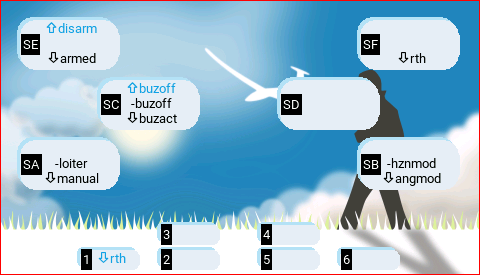
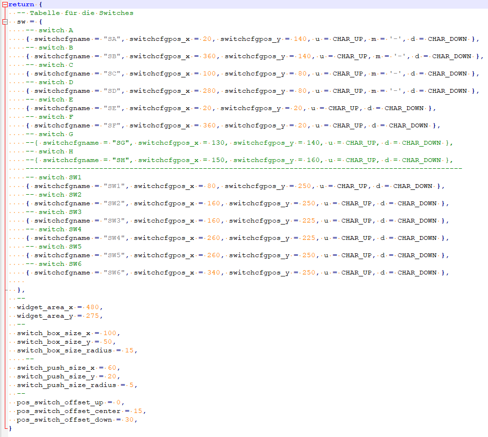

A simple widget to display switches which are configured in special function and have a PLAY_TRACK behind.

# Installing
* Copy the `src/WIDGETS/getswitches` folder to your handset's SD card in the `WIDGETS/` folder such that your SD card will end up with a file called `WIDGETS/getswitches/main.lua`.
* Add the widget to the main screen
  * Press the TELEM button on the handset and navigate to the second page.
  * Tap "Setup widgets".
  * Tap an open space and add the "SwitchOverview" widget.
  * Use the RTN / EXIT button to go back until you're on the main screen again.

## Requirements
* Tested on Jumper T15 with EdgeTX 2.6 only
* Currently there is a config File for Jumper T15, you are wellcome to generate your own config file WIDGETS\getswitches\radio.
  * the name will be shown if you have no config
  * you are wellcome to commit a config for your radio here
  * as example you can take the t15.lua config and only change the positions values and so on
  * other people can use your config then

## Other informations
* If a switch have two sound file on one switch it will toggle the two ore more soundfilenames. You can change the time for toggling in the WIDGETSconfig

## Whats not working
* currently the SW1 to SW6 switches and the poti is not working. Only SA-SH (depending on your radio)
  
